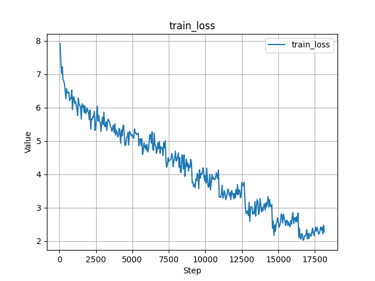
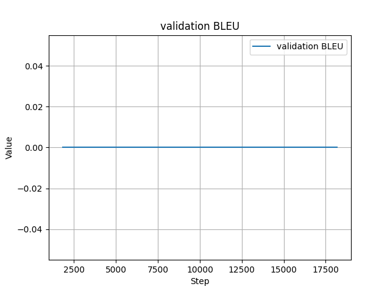
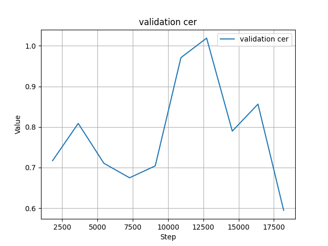
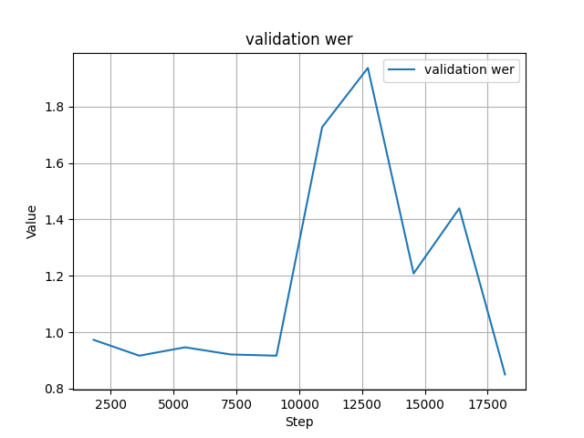

# English to Italian Translation with Encoder-Decoder 📚

## Assignment Overview
The goal of this assignment was to train an English to French translation model using the OPUS book translation dataset. The primary objective was to achieve a final loss of less than 4 during training in 10 epochs.

> Note: Not to use any optimization techniques

## Data Source and Preprocessing 📝
- **Dataset:** The dataset used for this task was the `OPUS book` translation dataset from hugging face.

## Model Architecture 🧠
- **Encoder-Decoder:** This model utilizes the encoder-decoder architecture for sequence-to-sequence translation tasks.
- **Model Size:** The model consists of approximately 70.2 million parameters.

## Training Configuration ⚙️
- **Batch Size:** Training was conducted with a batch size of `16.`
- **Epochs:** The training process spanned `10 epochs.`
- Used CrossEntrophy loss

### Learning Rate Scheduler
- No scheduler was used
- **Optimizer:** Used the ADAM optimizer.

## Training Results 📊
- **Final Loss:** The training loss reached `2.12`.
- Average time taken for 1 epoch is 14-15 min. 

### Training Plots

<table>
  <tr>
    <td align="center"><b>Average Train Loss Per Batch</b></td>
   
  <tr>
    <td></td>
  </tr>
</table>

### Evaluation Metrics

<table>
  <tr>
    <td align="center"><b>BLEU Score</b></td>
    <td align="center"><b>CER Validation</b></td>
    <td align="center"><b>WER Validation</b></td>
    
  </tr>
  <tr>
    <td></td>
    <td></td>
    <td></td>
  </tr>
</table>

