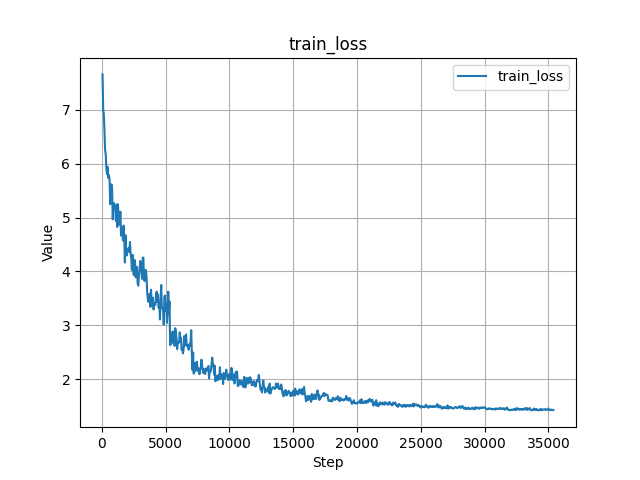
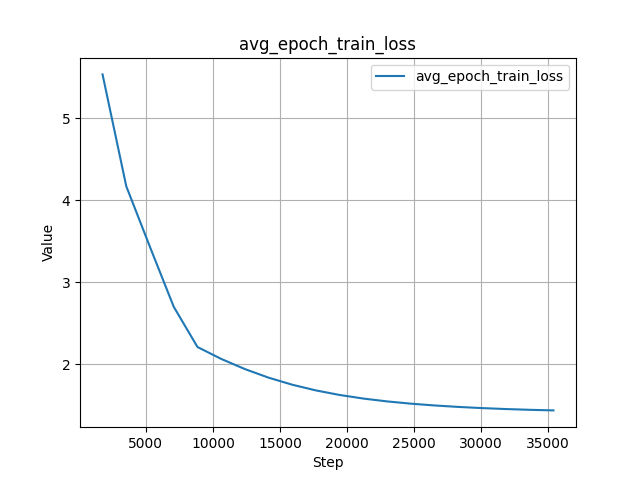
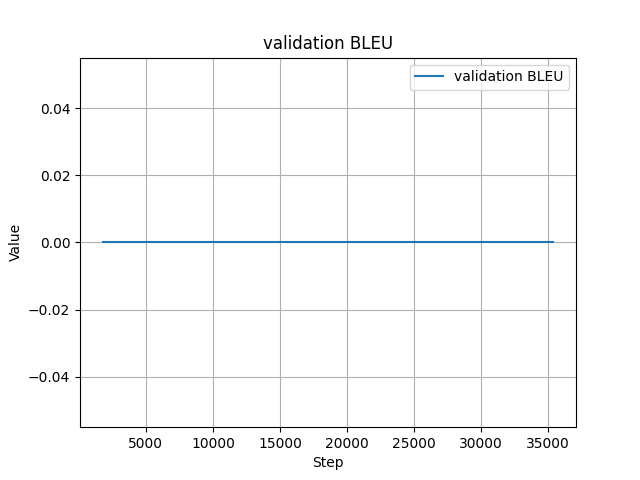
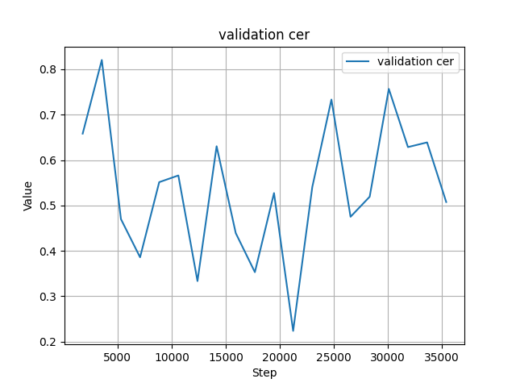
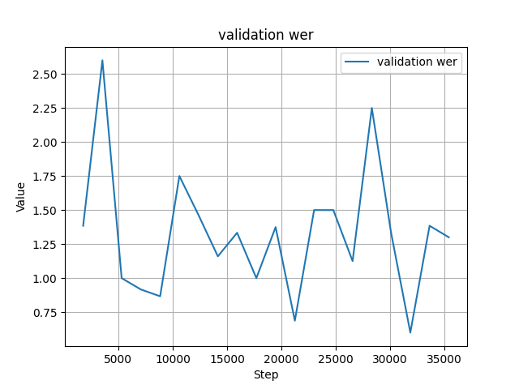
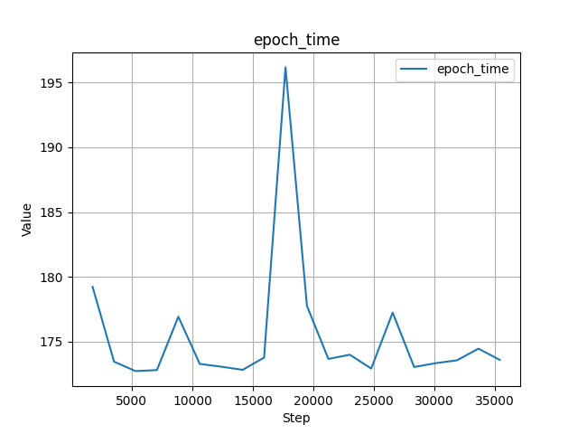

# English to French Translation with Encoder-Decoder 📚

## Assignment Overview
The goal of this assignment was to train an English to French translation model using the OPUS book translation dataset. The primary objective was to achieve a final loss of less than 1.8 during training.

## Data Source and Preprocessing 📝
- **Dataset:** The dataset used for this task was the `OPUS book` translation dataset from hugging face.
- **Data Preprocessing:**
  - Implemented dynamic padding to handle variable-length sequences efficiently.
  - Removed English sentences that exceeded 150 characters.
  - Removed French sentences whose length was greater than the corresponding English sentence length plus 10 characters.

## Model Architecture 🧠
- **Encoder-Decoder:** This model utilizes the encoder-decoder architecture for sequence-to-sequence translation tasks.
- **Parameter Sharing:** Implemented parameter sharing with a dense feedforward layer size (dff) of 1024.
- **Model Size:** The model consists of approximately 50.6 million parameters.

## Training Configuration ⚙️
- **Batch Size:** Training was conducted with a batch size of 32.
- **Epochs:** The training process spanned 20 epochs.

### Learning Rate Scheduler
- **One Cycle Policy Scheduler:** Applied the One Cycle policy scheduler with the following configuration:
  - Max learning rate (max_lr): 1e-3
  - Number of epochs: 20
  - Percentage of training for the increasing LR phase (pct_start): 10%
  - Steps per epoch: Determined by the length of the training data loader
  - Learning rate div factor (div_factor): 10
  - Three-phase learning rate annealing (three_phase)
  - Final learning rate div factor (final_div_factor): 10
  - Annealing strategy: Linear

- **Optimizer:** Used the ADAM optimizer.

## Training Results 📊
- **Final Loss:** The training loss reached 1.43.
- **Performance Metrics:** The translation model was evaluated using BLEU scores, achieving a score of X on the validation dataset and Y on the test dataset.

### Training Plots

1. Average Train Loss Per Batch

2. Average Train Loss Per Epoch

3. BLEU Score

4. CER Validation

5. WER Validation

6. Average Training Time Per Epoch (in seconds)

